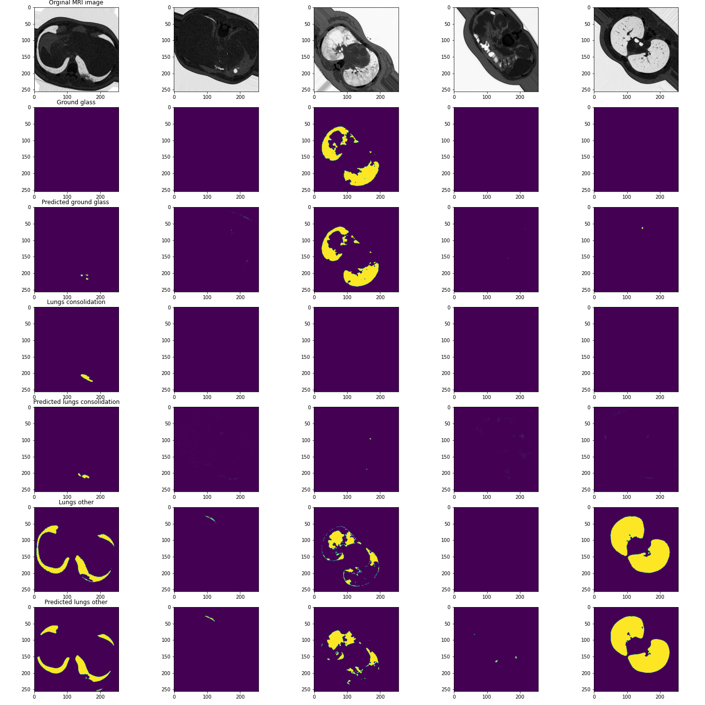

# Covid19_lungs_segmentation
Multiclass segmentation lungs infected by covid 19. Dataset was downloaded from one of the Kaggle repos. Available classes: groud glass, lungs consolidation, lungs other. Classes were coded into one hot tensors. As network architecture I choosed UNet with EfficientNet as backend. Loss function is binary Dice loss and as metrics i used IOU score. I added some basic augumentation from Albumentation library. My mean validation IOU score was about 0.67.

# Technologies
- Pytorch
- Torchvision
- Albumentations
- segmentation_models_pytorch
- some others commonly used librarys 

# Results

